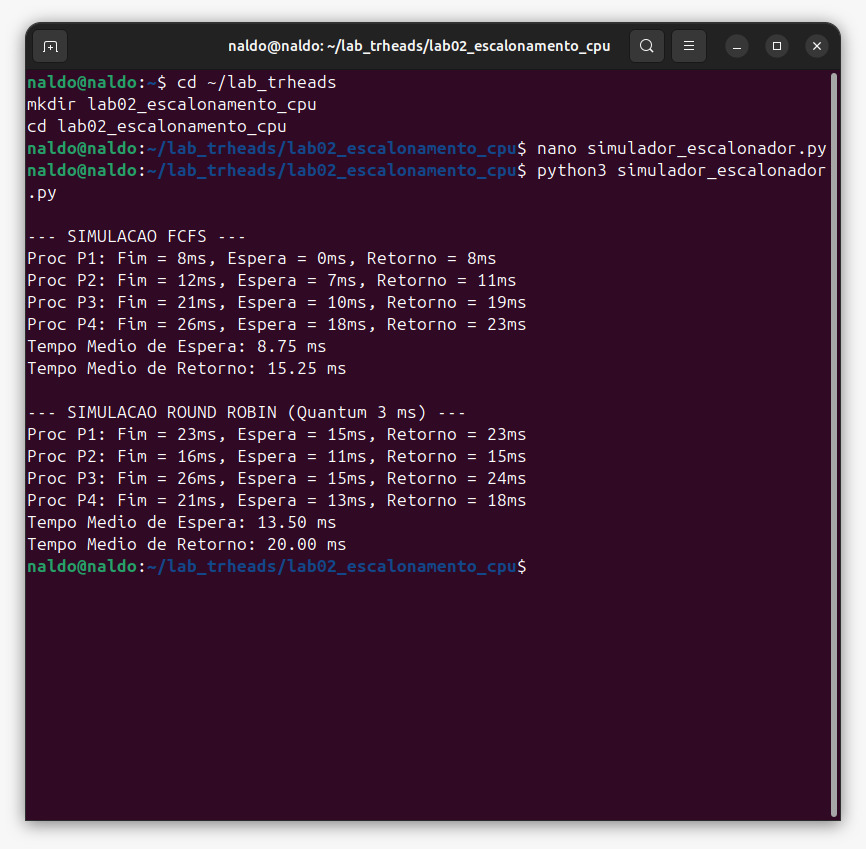
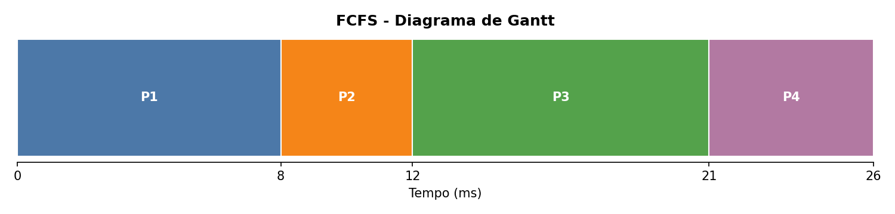
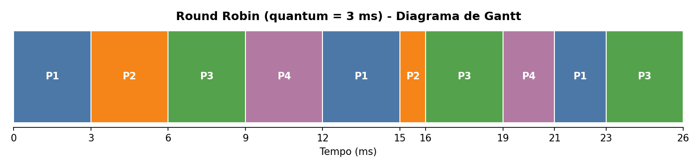
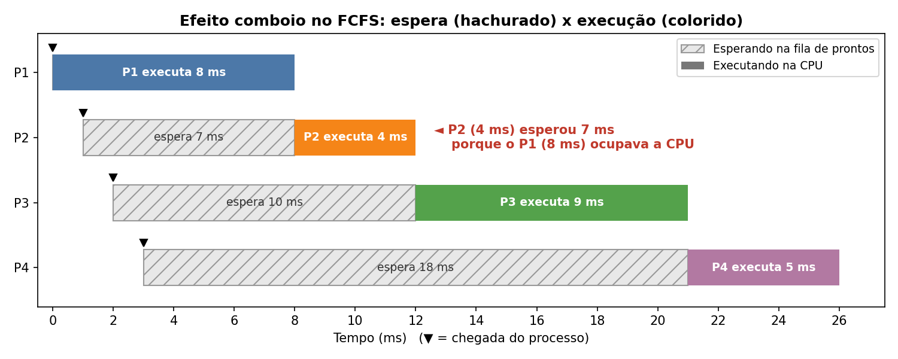
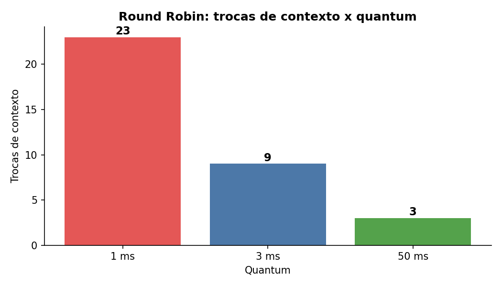
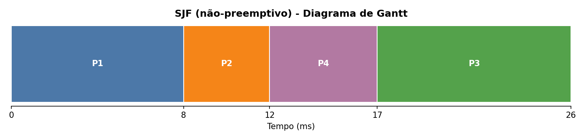
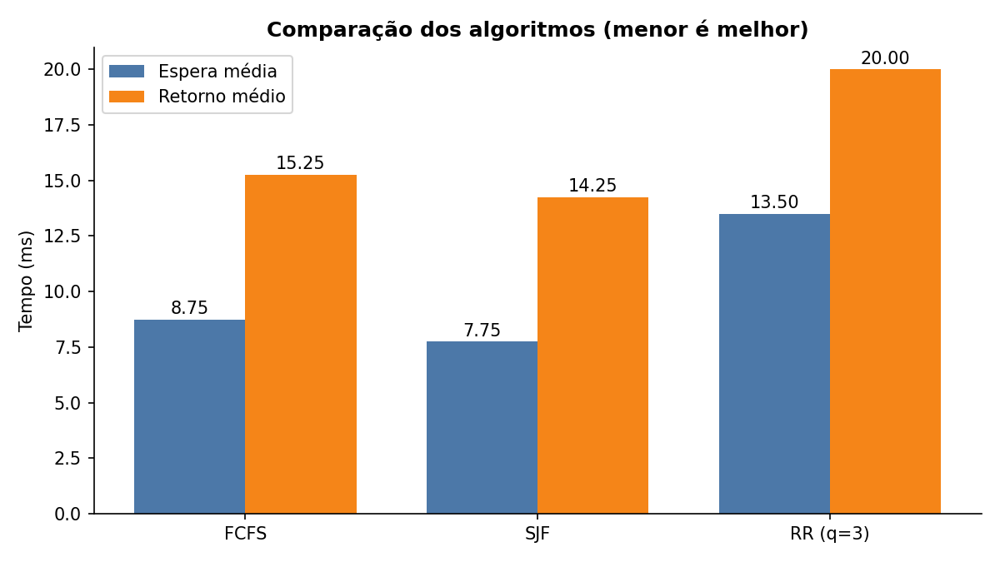

# Laboratório 02 — Simulação e Avaliação de Desempenho de Algoritmos de Escalonamento de CPU

| | |
|---|---|
| **Instituição** | UNIFADESA |
| **Curso** | Análise e Desenvolvimento de Sistemas (ADS) |
| **Disciplina** | Sistemas Operacionais — 4º Semestre / 2026.2 |
| **Docente** | Prof. Esp. Rodrigo Martins Sousa |
| **Aluno** | Bruno |
| **Avaliação** | N1 — Roteiro de Laboratório 02 (1,0 ponto) |
| **Entrega** | 01/10/2026 |

---

## Sumário

1. [Objetivo](#1-objetivo)
2. [Estrutura do repositório](#2-estrutura-do-repositório)
3. [Cenário de teste](#3-cenário-de-teste)
4. [Como executar](#4-como-executar)
5. [Resultado da execução do simulador](#5-resultado-da-execução-do-simulador)
6. [Atividades](#6-atividades)
   - [6.1 Efeito comboio no FCFS](#61-efeito-comboio-no-fcfs)
   - [6.2 Variação do quantum no Round Robin](#62-variação-do-quantum-no-round-robin)
   - [6.3 Resolução manual do SJF e comparação](#63-resolução-manual-do-sjf-e-comparação)
7. [Conclusão](#7-conclusão)
8. [Critérios de avaliação: onde encontrar cada item](#8-critérios-de-avaliação-onde-encontrar-cada-item)

---

## 1. Objetivo

Simular e comparar o desempenho de três algoritmos de escalonamento de CPU, usando como métricas o **tempo de espera** e o **tempo de retorno** (*turnaround*):

- **FCFS** (*First-Come, First-Served*): não-preemptivo, simples e vulnerável ao efeito comboio.
- **Round Robin (RR)**: preemptivo por fatia de tempo (*quantum*), adequado a sistemas interativos.
- **SJF** (*Shortest Job First*, não-preemptivo): foca em minimizar o tempo médio de espera.

Fórmulas utilizadas:

```
Retorno = Finalização − Chegada
Espera  = Retorno − Duração (burst)
```

---

## 2. Estrutura do repositório

```
lab02-escalonamento-cpu/
├── README.md                        # este documento (relatório)
├── requirements.txt                 # dependência dos gráficos (matplotlib)
├── .gitignore
├── src/
│   ├── simulador_escalonador.py     # simulador do roteiro (FCFS e Round Robin)
│   └── gerar_graficos.py            # Gantt, gráficos, SJF e variação do quantum
├── resultados/
│   ├── execucao_terminal.jpeg       # print da execução no terminal
│   ├── saida_simulador.txt          # log da saída do simulador
│   └── metricas_calculadas.txt      # log de FCFS, SJF, RR e variação do quantum
└── imagens/
    ├── gantt_fcfs.png
    ├── gantt_sjf.png
    ├── gantt_round_robin.png
    ├── efeito_comboio.png
    ├── comparacao_metricas.png
    └── quantum_trocas_contexto.png
```

---

## 3. Cenário de teste

Carga de trabalho com 4 processos:

| Processo (Pi) | Chegada (Tc) | Duração / Burst (Td) | Prioridade (1 = maior) |
|:---:|:---:|:---:|:---:|
| P1 | 0 ms | 8 ms | 3 |
| P2 | 1 ms | 4 ms | 1 |
| P3 | 2 ms | 9 ms | 4 |
| P4 | 3 ms | 5 ms | 2 |

> A coluna de prioridade não é utilizada, pois FCFS, Round Robin e SJF não levam prioridade em conta.

---

## 4. Como executar

Requisitos: Python 3. O simulador usa apenas a biblioteca padrão; o `matplotlib` é necessário somente para gerar os gráficos.

```bash
# 1) Clonar o repositório e entrar na pasta
git clone <URL-DO-REPOSITORIO>
cd lab02-escalonamento-cpu

# 2) Executar o simulador do roteiro (FCFS e Round Robin com quantum = 3 ms)
python3 src/simulador_escalonador.py

# 3) (Opcional) Regenerar gráficos e métricas de SJF e do quantum
pip install -r requirements.txt
python3 src/gerar_graficos.py
```

---

## 5. Resultado da execução do simulador

Execução do `simulador_escalonador.py` no terminal (Ubuntu):



O log completo está em [`resultados/saida_simulador.txt`](resultados/saida_simulador.txt).

### FCFS

| Processo | Finalização | Espera | Retorno |
|:---:|:---:|:---:|:---:|
| P1 | 8 ms | 0 ms | 8 ms |
| P2 | 12 ms | 7 ms | 11 ms |
| P3 | 21 ms | 10 ms | 19 ms |
| P4 | 26 ms | 18 ms | 23 ms |
| **Média** | | **8,75 ms** | **15,25 ms** |



### Round Robin (quantum = 3 ms)

| Processo | Finalização | Espera | Retorno |
|:---:|:---:|:---:|:---:|
| P1 | 23 ms | 15 ms | 23 ms |
| P2 | 16 ms | 11 ms | 15 ms |
| P3 | 26 ms | 15 ms | 24 ms |
| P4 | 21 ms | 13 ms | 18 ms |
| **Média** | | **13,50 ms** | **20,00 ms** |



---

## 6. Atividades

### 6.1 Efeito comboio no FCFS

**Pergunta:** demonstre graficamente como o processo longo P1 impactou o tempo de espera do processo curto P2 no FCFS.



No gráfico, a parte hachurada é o tempo em que o processo está pronto, mas aguardando a CPU; a parte colorida é o tempo em que ele executa.

**Análise:**

- O P1 chega em 0 ms e, como o FCFS é não-preemptivo, só libera a CPU em 8 ms.
- O P2 chega em 1 ms e precisa de apenas 4 ms de CPU, mas só começa a executar em 8 ms. Ele **espera 7 ms para executar 4 ms**, ou seja, passa 1,75 vez mais tempo na fila do que trabalhando.
- O atraso se propaga como um **comboio**: P3 espera 10 ms e P4 espera 18 ms (para apenas 5 ms de trabalho).
- Só o bloqueio causado pelo P1 já soma 18 ms (P2: 7, P3: 6, P4: 5), cerca de **51%** dos 35 ms de espera total do sistema.

**Relação com o desenvolvimento de software:** é o equivalente a uma requisição pesada que ocupa o único worker de uma API e deixa as requisições leves esperando atrás dela.

---

### 6.2 Variação do quantum no Round Robin

**Pergunta:** o que ocorre com a quantidade de trocas de contexto se o quantum for reduzido para 1 ms? E se for aumentado para 50 ms?

Resultados obtidos com a mesma lógica do simulador (script `src/gerar_graficos.py`):

| Quantum | Fatias de CPU | Trocas de contexto | Espera média | Retorno médio |
|:---:|:---:|:---:|:---:|:---:|
| 1 ms | 26 | **23** | 12,50 ms | 19,00 ms |
| 3 ms | 10 | **9** | 13,50 ms | 20,00 ms |
| 50 ms | 4 | **3** | 8,75 ms | 15,25 ms |



> Critério de contagem: troca de contexto é cada mudança da CPU de um processo para **outro** processo. O primeiro despacho não conta, e fatias consecutivas do mesmo processo (como o P3 sozinho no final, com quantum de 1 ms) não geram troca.

**Quantum de 1 ms**

- As trocas de contexto sobem de 9 para **23**, pois cada processo é interrompido a cada 1 ms.
- A responsividade é máxima: todos os processos recebem CPU quase imediatamente.
- Na simulação, as médias ficam ligeiramente melhores (12,50 ms / 19,00 ms), mas o simulador **considera o custo da troca igual a zero**. Em um sistema real, cada troca consome tempo (salvar e restaurar registradores, perda de cache e TLB), e esse *overhead* pode anular o ganho. Exemplo hipotético com 0,1 ms por troca: 23 trocas custariam 2,3 ms, cerca de 8,8% dos 26 ms de trabalho útil, contra 3,5% com quantum de 3 ms.

**Quantum de 50 ms**

- Como o quantum é maior que qualquer burst, nenhum processo é preemptado: são apenas **3 trocas** (uma entre cada processo).
- O Round Robin **degenera em FCFS**, com o mesmo resultado (8,75 ms / 15,25 ms) e o mesmo efeito comboio.
- O *overhead* é mínimo, mas a responsividade para sistemas interativos é perdida.

**Conclusão:** o quantum precisa ser um equilíbrio. Pequeno demais gera *overhead* excessivo de trocas; grande demais transforma o RR em FCFS.

---

### 6.3 Resolução manual do SJF e comparação

**Pergunta:** calcule manualmente o tempo médio de espera e retorno para o SJF (não-preemptivo) e compare com FCFS e Round Robin.

**Passo a passo (SJF não-preemptivo):** a cada vez que a CPU fica livre, escolhe-se, entre os processos já chegados, o de menor burst.

1. **t = 0:** só o P1 está na fila, então executa de 0 a 8 ms (não-preemptivo, vai até o fim).
2. **t = 8:** na fila estão P2 (4 ms), P3 (9 ms) e P4 (5 ms). O menor é o **P2**, que executa de 8 a 12 ms.
3. **t = 12:** na fila estão P3 (9 ms) e P4 (5 ms). O menor é o **P4**, que executa de 12 a 17 ms.
4. **t = 17:** resta o **P3**, que executa de 17 a 26 ms.

Ordem de execução: **P1 → P2 → P4 → P3**



**Cálculo (Retorno = Fim − Chegada; Espera = Retorno − Burst):**

| Processo | Chegada | Burst | Fim | Retorno | Espera |
|:---:|:---:|:---:|:---:|:---:|:---:|
| P1 | 0 | 8 | 8 | 8 − 0 = 8 | 8 − 8 = 0 |
| P2 | 1 | 4 | 12 | 12 − 1 = 11 | 11 − 4 = 7 |
| P4 | 3 | 5 | 17 | 17 − 3 = 14 | 14 − 5 = 9 |
| P3 | 2 | 9 | 26 | 26 − 2 = 24 | 24 − 9 = 15 |

```
Espera média  = (0 + 7 + 9 + 15) / 4 = 31 / 4 = 7,75 ms
Retorno médio = (8 + 11 + 14 + 24) / 4 = 57 / 4 = 14,25 ms
```

Os valores foram conferidos pelo script `src/gerar_graficos.py` (ver [`resultados/metricas_calculadas.txt`](resultados/metricas_calculadas.txt)).

**Comparação entre os algoritmos:**

| Algoritmo | Espera média | Retorno médio | Trocas de contexto | Resposta média* |
|:---|:---:|:---:|:---:|:---:|
| FCFS | 8,75 ms | 15,25 ms | 3 | 8,75 ms |
| **SJF (não-preemptivo)** | **7,75 ms** | **14,25 ms** | 3 | 7,75 ms |
| Round Robin (q = 3 ms) | 13,50 ms | 20,00 ms | 9 | **3,00 ms** |

\* Tempo de resposta = tempo entre a chegada e a **primeira** execução na CPU.



**Análise:**

- **SJF teve as melhores médias de espera e retorno.** Em relação ao FCFS, reduziu a espera em 1,00 ms (cerca de 11%); em relação ao Round Robin, em 5,75 ms (cerca de 43%). Isso acontece porque os processos curtos (P2 e P4) passam à frente do longo (P3), e assim poucos processos esperam por muito tempo.
- **FCFS** ficou em segundo lugar. A ordem de chegada colocou o P3 (9 ms) antes do P4 (5 ms), o que aumentou a espera do P4 de 9 ms para 18 ms.
- **Round Robin teve as piores médias** (13,50 ms / 20,00 ms), porque o revezamento atrasa o término de todos os processos e gera mais trocas de contexto (9). Em compensação, tem o **melhor tempo de resposta (3,00 ms)**, que é o que importa em sistemas interativos.
- **Limitações do SJF:** exige conhecer (ou estimar) o tempo de execução de antemão e pode causar **inanição** (*starvation*) de processos longos se chegarem continuamente processos curtos. Aqui, o P3 (o mais longo) teve a pior espera (15 ms).

---

## 7. Conclusão

| Se o objetivo for... | Algoritmo mais indicado |
|:---|:---|
| Menor tempo médio de espera e retorno | **SJF** (com a ressalva da inanição) |
| Simplicidade de implementação | **FCFS** (com o risco do efeito comboio) |
| Responsividade em sistemas interativos | **Round Robin** (com quantum bem ajustado) |

Não existe um algoritmo melhor em todos os cenários: a escolha depende da métrica que o sistema precisa priorizar. O laboratório mostrou que um processo longo à frente da fila prejudica os curtos (FCFS), que o quantum controla o equilíbrio entre responsividade e *overhead* (RR) e que priorizar os processos curtos reduz as médias de espera (SJF).

---

## 8. Critérios de avaliação: onde encontrar cada item

| Item | Critério | Onde está |
|:---|:---|:---|
| 1. Execução do script | Saída correta do simulador com gráficos/logs | [Seção 5](#5-resultado-da-execução-do-simulador), [`resultados/`](resultados/) e [`imagens/`](imagens/) |
| 2. Análise comparativa | Respostas técnicas fundamentadas sobre métricas | [Seção 6](#6-atividades) (questões 1, 2 e 3) |
| 3. Organização | Estruturação do repositório no GitHub | [Seção 2](#2-estrutura-do-repositório) |
